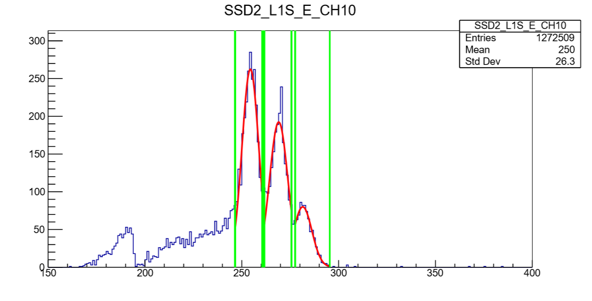
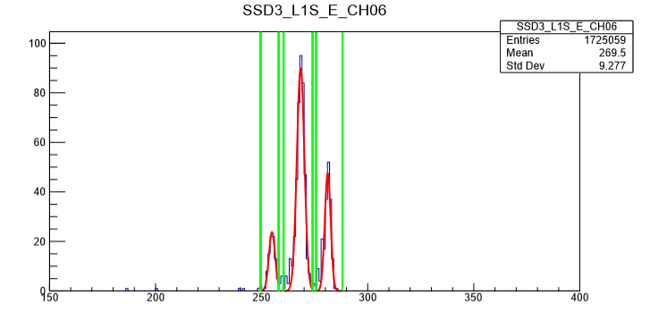
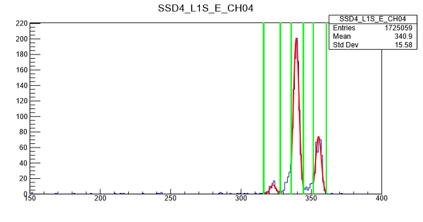

Fission2019 实验数据说明文档
==========================

目录
-----
[toc]

----------------------------------------------------------------------------------------
## 刻度文件说明
> 探测器刻度分硅条探测器(SSD)刻度与PPAC刻度

### 硅条刻度 
#### Pulser刻度
| Pulser刻度  |   刻度条件说明  |   刻度点数目    | 备注|
|:------------|:--------------|:-----------:|:---------|
|SSD1_L1_PulserCali_Switch.0000|衰减因子: 1,2,4,5,10,20,40,50| 8 |衰减100倍CO4020闪亮|
|SSD2_L1_PulserCali_Switch.0000|衰减因子: 1,2,4,5,10,20      | 6 |
|SSD3_L1_PulserCali_Switch.0000|衰减因子: 1,2,4,5,10         | 5 |
|SSD4_L1_PulserCali_Switch.0000|衰减因子: 1,2,4,5,10         | 5 |
|SSD1_L2_PulserCali_Switch.0000|衰减因子: 1,2,4,5,10,20,40,50,100  | 9 |
|SSD2_L2_PulserCali_Switch.0000|衰减因子: 1,2,4,5,10,20,40,50      | 8 |
|SSD3_L2_PulserCali_Switch.0000|衰减因子: 1,2,4,5,10,20            | 6 |
|SSD4_L2_PulserCali_Switch.0000|衰减因子: 1,2,4,5,10,20,40,50      | 8 |
|SSD1_L1_PulserCali_Height.0000|相对幅度: 10,9,8,7,6,5,4,3,2,1,0.5 | 11 | 
|SSD2_L1_PulserCali_Height.0000|相对幅度: 10,9,8,7,6,5,4,3,2,1,0.5 | 11 |
|SSD3_L1_PulserCali_Height.0000|相对幅度: 10,9,8,7,6,5,4,3,2,1     | 10 |
|SSD4_L1_PulserCali_Height.0000|相对幅度: 10,9,8,7,6,5,4,3,2,1     | 10 | 0.5的统计～20！SSD4_L1刻度时有噪声 |
|SSD1_L2_PulserCali_Height.0000|相对幅度: 10,9,8,7,6,5,4,3,2,1,0.5| 11 | 
|SSD2_L2_PulserCali_Height.0000|相对幅度: 10,9,8,7,6,5,4,3,2,1,0.5| 11 |T115000,T115001信号是其他的一半|
|SSD3_L2_PulserCali_Height.0000|相对幅度: 10,9,8,7,6,5,4,3,2,1,0.5| 11 |
|SSD4_L2_PulserCali_Height.0000|相对幅度: 10,9,8,7,6,5,4,3,2,1,0.5| 11 |

#### Alpha刻度
> SSD的Layer1刻度时,作了以下改变: 
>+ SSD1_L1主放gain修改: 由 2 × 4   变成  2 × 20 
>+ SSD2_L1主放gain修改: 由 2 × 7.4 变成  2 × 20 

| Alpha刻度  |   刻度条件说明    | 备注 |
|:------------|:--------------|:---------|
|SSD_L1_AlphaCali.0000| 同时刻度4块SSD的Layer1 | SSD1_L1计数正常 |
|SSD_L1_AlphaCali.0001| 同时刻度4块SSD的Layer1 | SSD2_L1计数正常 |
|SSD_L1_AlphaCali.0002| 同时刻度4块SSD的Layer1 | SSD3_L1部分无计数,需进行二次刻度  |
|SSD_L1_AlphaCali.0003| 同时刻度4块SSD的Layer1 | SSD4_L1 CH0无计数(实验中也无计数) |
|SSD_L1_AlphaCali.0004| 同时刻度4块SSD的Layer1 |

>  第一次 $\alpha$ 源刻度时，SSD3、SSD4部分 strips 计数率过低，需要开靶室进行第二次刻度！

| Alpha刻度  |   刻度条件说明    | 备注 |
|:------------|:--------------|:---------|
|SSD_L1_AlphaCali.0005| 主要刻度SSD3_L1,SSD4_L1| 第一次Alpha刻度部分无计数,开靶盖第二次刻度|
|SSD_L1_AlphaCali.0006| 主要刻度SSD3_L1,SSD4_L1| 第一次Alpha刻度部分无计数,开靶盖第二次刻度|
|SSD_L1_AlphaCali.0007| 主要刻度SSD3_L1,SSD4_L1| 第一次Alpha刻度部分无计数,开靶盖第二次刻度|
|SSD_L1_AlphaCali.0008| 主要刻度SSD3_L1,SSD4_L1| 第一次Alpha刻度部分无计数,开靶盖第二次刻度|

| Alpha刻度  |   刻度条件说明    | 备注 |
|:------------|:--------------|:---------|
|SSD_L2_AlphaCali.0000| SSD1的Trig: SSD1_L2F | T112014统计很低！ T121013 & T121014信号异常！|
|SSD_L2_AlphaCali.0001| SSD1的Trig: SSD1_L2F | T112014统计很低！ T121013 & T121014信号异常！|
|SSD_L2_AlphaCali.0002| SSD1的Trig: SSD1_L2F | T112014统计很低！ T121013 & T121014信号异常！|
|SSD_L2_AlphaCali.0003| SSD1的Trig: SSD1_L2F | T112014统计很低！ T121013 & T121014信号异常！|
|SSD_L2_AlphaCali.0004| SSD1的Trig: SSD1_L2F | T112014统计很低！ T121013 & T121014信号异常！|
|SSD_L2_AlphaCali.0005| SSD1的Trig: SSD1_L2F | T112014统计很低！ T121013 & T121014信号异常！|
|SSD_L2_AlphaCali.0006| SSD1的Trig: SSD1_L2F | T112014统计很低！ T121013 & T121014信号异常！|
|SSD_L2_AlphaCali.0007| SSD1的Trig: SSD1_L2F | T112014统计很低！ T121013 & T121014信号异常！|
|SSD_L2_AlphaCali.0008| SSD1的Trig: SSD1_L2F | T112014统计很低！ T121013 & T121014信号异常！|
|SSD_L2_AlphaCali.0009| SSD1的Trig: SSD1_L2F | T112014统计很低！ T121013 & T121014信号异常！|
|SSD_L2_AlphaCali.0010| SSD1的Trig: SSD1_L2F | T112014统计很低！ T121013 & T121014信号异常！|
|SSD_L2_AlphaCali.0011| SSD1的Trig: SSD1_L2F | T112014统计很低！ T121013 & T121014信号异常！|
|SSD_L2_AlphaCali.0012| SSD1的Trig: SSD1_L2F | T112014统计很低！ T121013 & T121014信号异常！|
|SSD_L2_AlphaCali.0013| SSD1的Trig: SSD1_L2F | T112014统计很低！ T121013 & T121014信号异常！|
|SSD_L2_AlphaCali.0014| SSD1的Trig: SSD1_L2F | T112014统计很低！ T121013 & T121014信号异常！|
|SSD_L2_AlphaCali.0015| SSD1的Trig: SSD1_L2F | T112014统计很低！ T121013 & T121014信号异常！|
|SSD_L2_AlphaCali.0016| SSD1的Trig: SSD1_L2F | T112014统计很低！ T121013 & T121014信号异常！|
|SSD_L2_AlphaCali.0017| SSD1的Trig: SSD1_L2F | T112014统计很低！ T121013 & T121014信号异常！|
|SSD_L2_AlphaCali.0018| SSD1的Trig: SSD1_L2F | T112014统计很低！ T121013 & T121014信号异常！|
|SSD_L2_AlphaCali.0019| SSD1的Trig: SSD1_L2F | T112014统计很低！ T121013 & T121014信号异常！|
|SSD_L2_AlphaCali.0020| SSD1的Trig: SSD1_L2F | T112014统计很低！ T121013 & T121014信号异常！|
|SSD_L2_AlphaCali.0021| SSD1的Trig: SSD1_L2F | T112014统计很低！ T121013 & T121014信号异常！|
|SSD_L2_AlphaCali.0022| SSD1的Trig: SSD1_L2F | T112014统计很低！ T121013 & T121014信号异常！|
|SSD_L2_AlphaCali.0023| SSD1的Trig: SSD1_L2F | T112014统计很低！ T121013 & T121014信号异常！|
|SSD_L2_AlphaCali.0024| SSD1的Trig: SSD1_L2F | T112014统计很低！ T121013 & T121014信号异常！|
|SSD_L2_AlphaCali.0025| SSD1的Trig: SSD1_L2F | T112014统计很低！ T121013 & T121014信号异常！|
|SSD_L2_AlphaCali.0026| SSD1的Trig: SSD1_L2F | T112014统计很低！ T121013 & T121014信号异常！|
|SSD_L2_AlphaCali.0027|SSD1的Trig: SSD1_L2F | T112014统计很低！ T121013 & T121014信号异常！|
|SSD_L2_AlphaCali.0028| SSD1的Trig: SSD1_L2F | T112014统计很低！ T121013 & T121014信号异常！|
|SSD_L2_AlphaCali.0029| SSD1的Trig: SSD1_L2F | T112014统计很低！ T121013 & T121014信号异常！|
|SSD_L2_AlphaCali.0030| SSD1的Trig: SSD1_L2F | T112014统计很低！ T121013 & T121014信号异常！|
|SSD_L2_AlphaCali.0031| SSD1的Trig: SSD1_L2F | T112014统计很低！ T121013 & T121014信号异常！|
|SSD_L2_AlphaCali.0032| SSD1的Trig: SSD1_L2F | T112014统计很低！ T121013 & T121014信号异常！|

| Alpha刻度  |   刻度条件说明    | 备注 |
|:------------|:--------------|:---------|
|SSD_L2_AlphaCali.0033| SSD1的Trig: SSD1_L2B | T112028统计很低！ T121013 & T121014信号异常！|
|SSD_L2_AlphaCali.0034| SSD1的Trig: SSD1_L2B | T112028统计很低！ T121013 & T121014信号异常！|
|SSD_L2_AlphaCali.0035| SSD1的Trig: SSD1_L2B | T112028统计很低！ T121013 & T121014信号异常！|
|SSD_L2_AlphaCali.0036| SSD1的Trig: SSD1_L2B | T112028统计很低！ T121013 & T121014信号异常！|
|SSD_L2_AlphaCali.0037| SSD1的Trig: SSD1_L2B | T112028统计很低！ T121013 & T121014信号异常！|
|SSD_L2_AlphaCali.0038| SSD1的Trig: SSD1_L2B | T112028统计很低！ T121013 & T121014信号异常！|
|SSD_L2_AlphaCali.0039| SSD1的Trig: SSD1_L2B | T112028统计很低！ T121013 & T121014信号异常！|
|SSD_L2_AlphaCali.0040| SSD1的Trig: SSD1_L2B | T112028统计很低！ T121013 & T121014信号异常！|
|SSD_L2_AlphaCali.0041| SSD1的Trig: SSD1_L2B | T112028统计很低！ T121013 & T121014信号异常！|
|SSD_L2_AlphaCali.0042| SSD1的Trig: SSD1_L2B | T112028统计很低！ T121013 & T121014信号异常！|
|SSD_L2_AlphaCali.0043| SSD1的Trig: SSD1_L2B | T112028统计很低！ T121013 & T121014信号异常！|
|SSD_L2_AlphaCali.0044| SSD1的Trig: SSD1_L2B | T112028统计很低！ T121013 & T121014信号异常！|
|SSD_L2_AlphaCali.0045| SSD1的Trig: SSD1_L2B | T112028统计很低！ T121013 & T121014信号异常！|
|SSD_L2_AlphaCali.0046| SSD1的Trig: SSD1_L2B | T112028统计很低！ T121013 & T121014信号异常！|
|SSD_L2_AlphaCali.0047| SSD1的Trig: SSD1_L2B | T112028统计很低！ T121013 & T121014信号异常！|
|SSD_L2_AlphaCali.0048| SSD1的Trig: SSD1_L2B | T112028统计很低！ T121013 & T121014信号异常！|

----------------------------------------------------------------------------------------
## 刻度时遇到的问题

### $\alpha$ 刻度文件中存在的问题
#### 硅条的Layer1
1. 合并 SSD_L1_AlphaCali.0000 - 0004:
   1.1 SSD3、SSD4部分统计较低
2. 合并 SSD_L1_AlphaCali.0005 - 0008:
   2.1 SSD2_L1S_E_CH10, CH12, CH13 在低能端有一个小峰，估计是噪声
   
   
   

   

